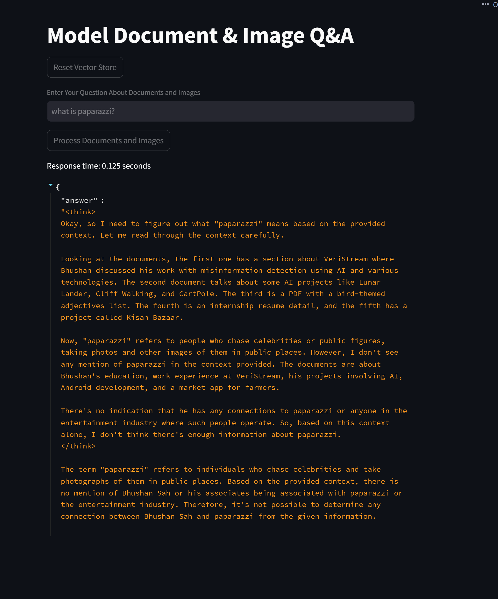
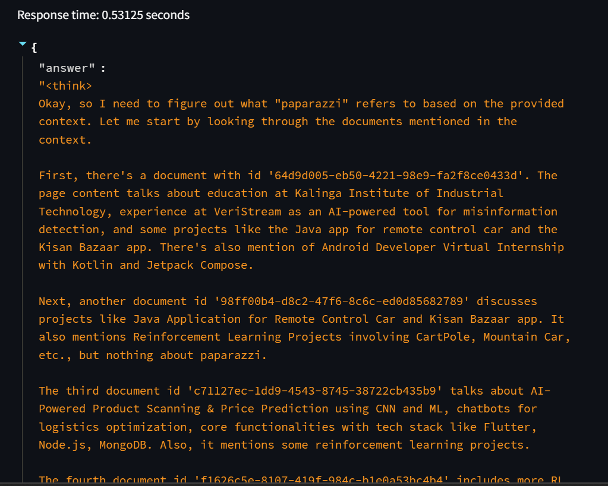
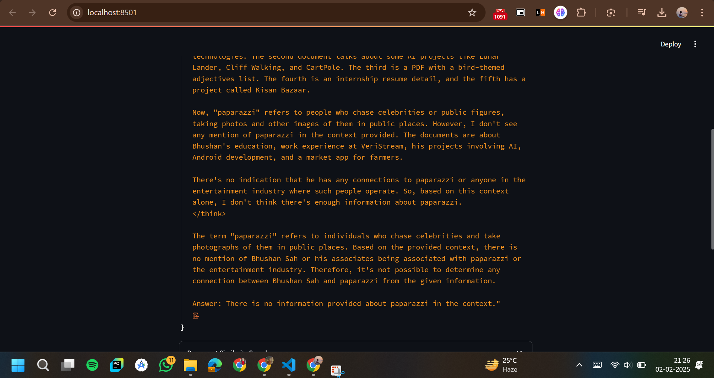
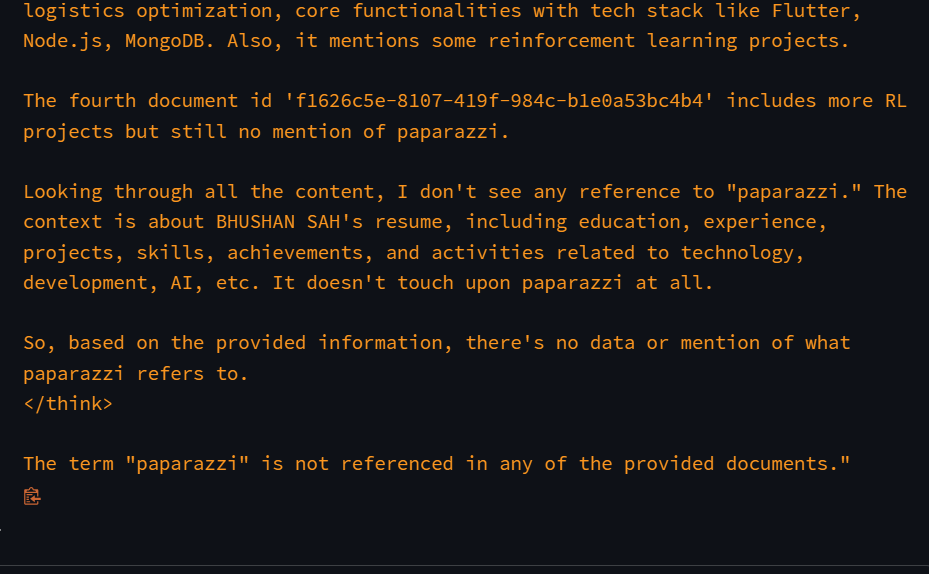

# SENSEI-SEARCH: Model Document & Image Q&A

This Streamlit application allows users to ask questions about documents (PDFs) and images using the Ollama API for text generation and embeddings.

## Features
- Process PDF documents and images (PNG, JPG, JPEG, GIF, BMP)
- Extract text from images using OCR (Optical Character Recognition)
- Create vector embeddings for efficient similarity search
- Answer questions based on the content of processed documents and images

## Prerequisites
- Python 3.7+
- Ollama installed and running locally

## Installation

### Clone this repository:
```sh
git clone https://github.com/yourusername/sensei-search.git
cd sensei-search
```

### Install required packages:
```sh
pip install -r requirements.txt
```

### Install Tesseract OCR:
- **For Windows:** Download and install from [Tesseract GitHub](https://github.com/UB-Mannheim/tesseract/wiki)
- **For macOS:**
  ```sh
  brew install tesseract
  ```
- **For Linux:**
  ```sh
  sudo apt-get install tesseract-ocr
  ```

## Usage
1. Place your PDF documents in the `./documents` directory.
2. Place your images in the `./images` directory.
3. Run the Streamlit app:
   ```sh
   streamlit run app2.py
   ```
4. Open your web browser and go to [http://localhost:8501](http://localhost:8501).
5. Click "Process Documents and Images" to initialize the vector store.
6. Enter your question in the text input and click "Enter" to get an answer.

## Screenshots





## Notes
- This application requires Ollama to be running locally, so it cannot be hosted on cloud platforms.
- The application uses the `deepseek-r1` model by default. Ensure this model is available in your Ollama installation.

## Troubleshooting
If you encounter any issues:
- Ensure Ollama is running and accessible.
- Check that all required libraries are installed.
- Verify that Tesseract OCR is properly installed and accessible in your system PATH.
